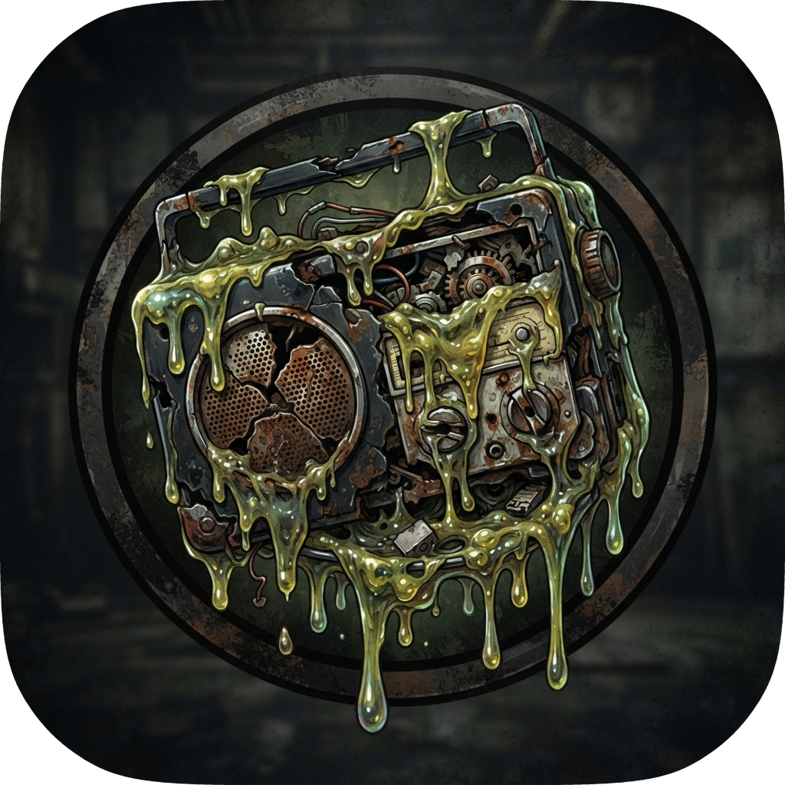

<div align="center">



# SlopRadio

**Your radio station, on air. Now with video, crossfades and a cue channel.**

[](#requirements)
[](#build-from-source)
[](https://github.com/luizfern12/slopradio/releases/tag/continuous)
[](https://github.com/gutierre69/lararadio)

[**⬇ Download**](https://github.com/luizfern12/slopradio/releases/tag/continuous) ·
[**What's new**](#-whats-new-vs-the-original) ·
[**Build from source**](#-build-from-source) ·
[**Changelog**](CHANGELOG.md)

</div>

---

SlopRadio is an enhanced fork of [gutierre69/lararadio](https://github.com/gutierre69/lararadio) that leans heavily on LLM-generated code — hence the "slop" in the name.

> [!TIP]
> Jump straight to [what this fork adds on top](#-whats-new-vs-the-original) of the original.

## 📦 Install

### Requirements

| | Requirement | Notes |
|---|---|---|
| 🖥️ | **x86_64 Linux** | The AppImage is built on Ubuntu 22.04 and runs on Ubuntu 22.04+, Debian 12+ and similar distros. |
| 🎞️ | **`ffmpeg`** in `PATH` *(recommended)* | Lets SlopRadio transcode MP3 files with embedded album art on the fly (avoids a decoder crash). Playback works without it — such files simply fall back to playing the original. |

---

## ✨ What's new vs the original

The original LaraRadio kept the station on air with a solid core: **playlist automation, jingles, time announcements, VU meters and a clock**. This fork keeps all of that and adds:

### 🎬 Video output with crossfade transitions

Tracks with video play in a dedicated video window, and the same crossfade used for audio blends the video between tracks (OpenGL mixer, shader transitions supported).

Video decoding can be hardware-accelerated — **Auto / VA-API / CUDA / Off**, chosen in **Settings → Video** — which keeps weak CPUs from dropping frames.

### 🚀 Faster startup, modern look

- Splash screen removed — the main window appears as soon as initialization finishes (≈ 2 s faster).
- The main window is freely resizable and keeps its proportions at any size.

### 🎧 Studio workflow

- **Pre-cue** — right-click any playlist row *or any file in the left-hand browsers* to open a cue window with its own transport (seek, play/pause/stop) and **headphone volume**, routed to a separate output device.
- **Output device selection** — pick the main output *and* a dedicated cue/headphones device (**Settings → Saídas**), hot-plug aware.
- **Playlist improvements** — drag & drop from the file manager (files or whole folders), multi-select with `Ctrl`/`Shift` + `Del` to remove, and playback pointers that survive row removals.

---

## 🔧 Build from source

**Requirements:** Qt 6.8+, CMake 3.16+, a C++ compiler and TagLib.

```bash
./build.sh          # compiles translations, configures and builds
./build/appLaraRadio
```

---

## 📚 Resources

- 📝 Full change log: [`CHANGELOG.md`](CHANGELOG.md)
- 🌱 Original project: [gutierre69/lararadio](https://github.com/gutierre69/lararadio)
